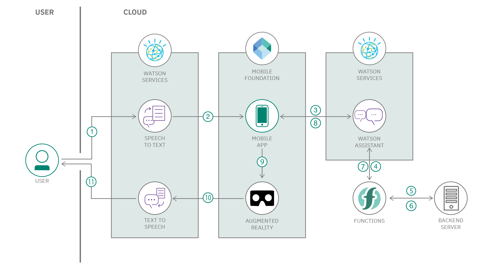

### ***Work in Progress***
# Avatar based dynamic chatbot powered with AI and AR capabilities

This Code Pattern is a demonstration of Avatar based Chatbot, an android mobile Chatbot Application with AI and AR capabilities which dynamically fetches the information using APIs in Watson Assistant via Webhooks(Cloud Functions).

When the reader has completed this Code Pattern, they will understand how to:

* Create and use Avatar using a Mobile Application.
* Use integrate Watson Assistant and Python Flask application using Webhooks. 
* Use Webhooks.
* Create a dynamic real time chatbot.

<!--add an image in this path-->

<!--Optionally, add flow steps based on the architecture diagram-->
## Flow

1. User asks a query to the AR Avatar.
2. Converts the speech to text using Watson speech to text and sends the query to IBM Mobile Foundation.
3. IBM Mobile Foundation securly passes the query to Watson Assistant.
4. Wastson Assistant will trigger appropriate Cloud Function, based on the query received.
5. Based on the query, Cloud Function will trigger the approriate service or services, in the backend application.
6. Backend Application returns the response for the query.
7. Cloud Function will send the response to Watson Assistant.
8. Wastson Assistant will frame a response to reply to the user and sends it to IBM Mobile Foundation.
9. IBM Mobile Foundation securly sends the response to the Mobile Application.
10. Converts the text into speech using Watson text to speech and replies to the user using the AR Avatar.

<!--Optionally, update this section when the video is created-->
# Watch the Video

## Pre-requisites
* [IBM Cloud account](https://www.ibm.com/cloud/): Create an IBM Cloud account.
* [Python 3](https://www.python.org/downloads/): Install python 3.
* [Android Studio](https://developer.android.com/studio): Install Android Studio.

# Steps

Please follow the below to setup and run this code pattern.

1. [Clone the repo](#1-clone-the-repo)
2. [Create Watson services with IBM Cloud](#2-create-watson-services-with-ibm-cloud)
3. [Update the details in the Backend Flask Application](#3-update-the-details-in-the-backend-flask-application)
4. [Deploy the Flask Application](#4-deploy-the-flask-application)
5. [Setup Cloud Functions](#5-setup-cloud-functions)
6. [Setup Watson Assistant](#6-setup-watson-assistant)
7. [Setup IBM Mobile Foundation Server and CLI](#7-setup-ibm-mobile-foundation-server-and-cli)
8. [Setup Google Cloud Anchors](#8-setup-google-cloud-anchors)
9. [Configure Android App](#9-configure-android-app)
10. [Build and Run Android App](#10-build-and-run-android-app)

# Sample output

 

# Troubleshooting

Refer to [Troubleshooting](Troubleshooting.md).

<!-- keep this -->
## License

[Apache 2.0](LICENSE)
